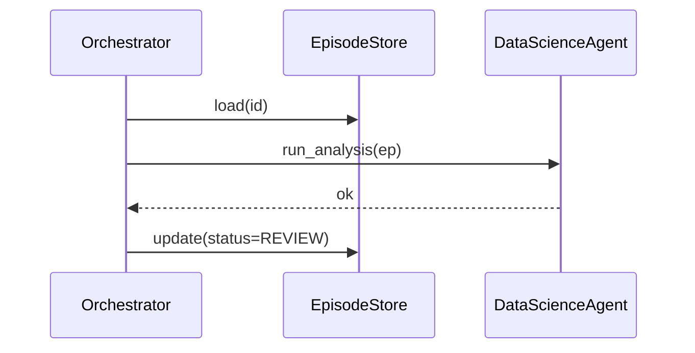

# PRD‑002: Orchestrator Skeleton  
*Version 0.1 • May 3 2025*

---

## 1 | Overview
This PRD defines the **initial Orchestrator component**—a lightweight controller that:

1. Loads an Episode record (`episode.json`)  
2. Determines the **next action** based on Episode status  
3. Invokes the corresponding method on a placeholder `DataScienceAgent`  
4. Updates Episode status and iteration history  
5. Persists changes atomically

The goal is **not** full autonomy, but a runnable control loop we can extend in future tiers.

---

## 2 | Problem / Goal
Manual coordination of Episode state is error‑prone.  
We need a programmatic “traffic cop” so agents and humans can rely on deterministic transitions and logs.

---

## 3 | Scope (Skeleton)
### 3.1 States & Actions (MVP)

| Current `status`      | Orchestrator Action              | Next `status` |
| --------------------- | -------------------------------- | ------------- |
| `SCOPED`              | call `agent.plan_analysis(ep)`   | `IN_ANALYSIS` |
| `IN_ANALYSIS`         | call `agent.run_analysis(ep)`    | `REVIEW`      |
| `REVISION`            | call `agent.revise_analysis(ep)` | `REVIEW`      |
| `BLOCKED`             | **no‑op**, log and exit          | unchanged     |
| `FINAL` or `ARCHIVED` | **no‑op**, exit                  | unchanged     |

### 3.2 CLI

```bash
python orchestrator.py DS-25-001  --once      # run one cycle
python orchestrator.py DS-25-001  --loop 60  # poll every 60 s
```

* `--loop` keeps running until Episode reaches `FINAL` or `ARCHIVED`.  
* Log to stdout + append to `episodes/<id>/history.log`.

### 3.3 Placeholder Agent

Create a stub `agents/ds_agent.py` with methods:

```python
class DataScienceAgent:
    def plan_analysis(self, episode): ...
    def run_analysis(self, episode): ...
    def revise_analysis(self, episode): ...
```

Each method just writes a line into `history.log` and sleeps 1 s (for now).

---

## 4 | Success Criteria
| Metric                                           | Target                        |
| ------------------------------------------------ | ----------------------------- |
| `--once` cycle runtime                           | ≤ 200 ms excluding stub sleep |
| Episode status update persists                   | 100 %                         |
| Illegal status (e.g., `FINAL`) exits with code 1 | 100 %                         |

---

## 5 | Non‑Functional Requirements
* Python 3.10
* Reuse Episode helper functions from PRD‑001  
* Graceful Ctrl‑C handling in `--loop` mode  
* No external services (memory integration deferred to PRD‑003)

---

## 6 | Out of Scope
* Parallel Episode handling  
* Error‑class retries  
* Real agent logic (analysis code)  
* Observability hooks (will be added in Tier 2)

---

## 7 | Deliverables
| Path                         | File / Artifact          |
| ---------------------------- | ------------------------ |
| `src/orchestrator.py`        | Orchestrator class + CLI |
| `src/agents/ds_agent.py`     | Placeholder agent        |
| `tests/test_orchestrator.py` | Unit tests               |
| `docs/orchestrator_flow.mmd` | Mermaid sequence diagram |

---

## 8 | Acceptance Checklist
- [ ] `pytest -q` green, ≥ 90 % coverage on `src/orchestrator.py`  
- [ ] `python orchestrator.py <id> --once` transitions status correctly  
- [ ] `--loop` breaks when Episode reaches `FINAL`  
- [ ] Ctrl‑C stops loop without corrupting Episode file  
- [ ] Docstrings & type hints present  
- [ ] Pre‑commit hooks (`black`, `isort`, `flake8`) clean  

---

## 9 | Mermaid Sequence Diagram
See `docs/orchestrator_flow.mmd`; excerpt:



---

## 10 | Dependencies / References
* PRD‑001 Episode Object  
* Architecture overview document (`docs/architecture_overview.md`)  

---

*End of PRD*