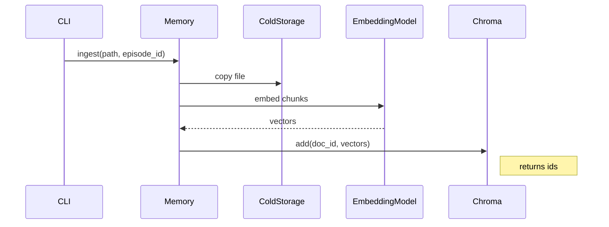

# PRD‑003: Memory Backbone  
*Version 0.1 • May 3 2025*

---

## 1 | Overview  
The **Memory Backbone** provides persistent, searchable context for agents.  
It consists of:

1. **Cold Storage** – raw documents (markdown, PDF, code, CSV) saved verbatim.  
2. **Vector Store** – embeddings index for semantic retrieval (Chroma, SQLite‑backed).  
3. **Retrieval API** – Python wrapper used by agents to `ingest()` docs and `query()` memory.

This PRD specifies the MVP implementation so future agents can recall org docs, prior analyses, and Episode artifacts during reasoning.

---

## 2 | Problem / Goal  
LLM prompts alone cannot hold the full history of a project.  
We need a fast, local memory layer to:

* Ingest documents once, reference many times.  
* Retrieve the  *k* most relevant chunks (< 1 s) for injection into prompts.  
* Link retrieved chunks back to source URIs for auditability.

---

## 3 | Scope (MVP)  

### 3.1 Folder layout  

```
/memory/
   raw/                 ← original files
   chroma/              ← SQLite + FAISS index (auto‑created)
   tmp/                 ← scratch during ingestion
```

### 3.2 Public API (src/ds_agent/memory.py)  

```python
class Memory:
    def ingest(self, path: Path, *, episode_id: str | None = None) -> str:
        """Add a file or folder to memory. Returns document_id."""

    def query(self, text: str, k: int = 5) -> list[MemoryChunk]:
        """Return top-k chunks (score, content, metadata)."""
```

* `MemoryChunk` includes `content`, `score`, `source_uri`, `episode_id`.

### 3.3 Embedding backend  

* Default → **sentence‑transformers/all‑MiniLM‑L6‑v2** via `sentence_transformers` (no external API calls).  
* Environment variable `EMBEDDING_MODEL=...` allows future swap to OpenAI or custom model.

### 3.4 CLI  

```bash
python bin/memory.py ingest docs/design/*.md --episode DS-25-002
python bin/memory.py query "signup success metric definition" -k 3
```

### 3.5 Auto‑ingest hook  

* Orchestrator appends newly created notebooks / reports to memory via `Memory.ingest()`.

---

## 4 | Success Criteria  

| Metric                                  | Target                          |
| --------------------------------------- | ------------------------------- |
| Ingest time (1 MB markdown)             | ≤ 2 s                           |
| Query latency, k=5                      | ≤ 500 ms                        |
| Retrieval precision (manual spot check) | Subjectively on‑topic 4/5 times |
| Unit‑test coverage (`src/memory.py`)    | ≥ 90 %                          |

---

## 5 | Non‑Functional Requirements  

* **Local‑only** dependencies; no network calls by default.  
* Concurrency‑safe writes (file lock around `chroma/`).  
* Embeddings cached; re‑ingesting same file is a no‑op (hash check).  
* Works on Python 3.10+.  
* RAM usage < 1 GB when index ≤ 100 MB.

---

## 6 | Out of Scope  

* Symbolic knowledge graph (planned Tier 2).  
* Cross‑Episode similarity search (will come with graph).  
* Access‑control layer (future security tier).  

---

## 7 | Deliverables  

| Path                          | Artifact                        |
| ----------------------------- | ------------------------------- |
| `src/ds_agent/memory.py`      | Memory class & helper functions |
| `bin/memory.py`               | Argparse CLI                    |
| `tests/test_memory.py`        | Unit + integration tests        |
| `docs/memory_architecture.md` | Design notes & usage examples   |

---

## 8 | Acceptance Checklist  

- [ ] Ingest markdown, code, and txt files; skip binaries except PDF.  
- [ ] Duplicate ingest does not create new embeddings.  
- [ ] `query()` returns list of `MemoryChunk` with `source_uri`.  
- [ ] `pytest --cov` ≥ 90 %.  
- [ ] README section "Using the Memory CLI" with examples.  
- [ ] Pre‑commit hooks clean.

---

## 9 | Sequence Diagram  

Mermaid source in `docs/memory_sequence.mmd`:



---

## 10 | Dependencies / References  

* PRD‑001 Episode Object (episode_id linkage)  
* PRD‑002 Orchestrator (auto‑ingest hook)  
* Architecture Overview (`docs/architecture_overview.md`)  

---

*End of PRD*