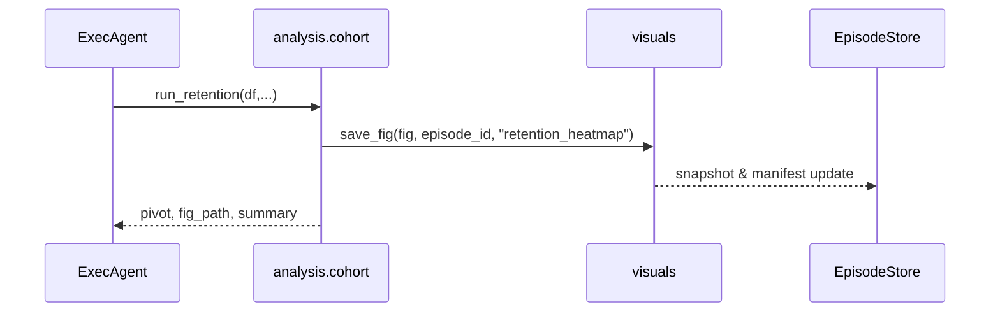

# PRD‑007: Analysis Function Library  
*Version 0.1 • May 3 2025*

---

## 1 | Overview  
Introduce a **tested Python library of analytical primitives** that agents can call to perform common data‑science tasks without re‑implementing logic in every Episode.

| Module            | Functions                                                         | Purpose                                                                 |
| ----------------- | ----------------------------------------------------------------- | ----------------------------------------------------------------------- |
| `cohort.py`       | `run_retention(df, signup_date, event_date, user_id, period="W")` | Returns retention pivot + heatmap figure + markdown summary             |
| `segmentation.py` | `lift_table(df, metric_col, dim_col)`                             | Computes lift vs. baseline + p‑values; returns DataFrame + md summary   |
| `funnel.py`       | `funnel_conversion(df, step_cols)`                                | Calculates step‑to‑step conversion and bar plot                         |
| `stat_tests.py`   | `bootstrap_mean_diff(a, b, n=5000, ci=0.95)`                      | Bootstrap mean diff CI + p; returns dict                                |
| `visuals.py`      | `save_fig(fig, episode_id, name)`                                 | Saves PNG to Episode outputs, registers artifact, returns relative path |

Each function **must**:
1. Accept Pandas data structures (ExecAgent supplies them).  
2. Return numeric results **and** a matplotlib Figure (where applicable).  
3. Save supporting CSV/PNG using `visuals.save_fig`.  
4. Emit a concise markdown summary string for notebook insertion.

---

## 2 | Problem / Goal  
*Reliability* – stats logic is deterministic and unit‑tested.  
*Speed* – agents spend fewer tokens generating boilerplate.  
*Reusability* – new Episodes reuse proven code.

---

## 3 | Scope (MVP)

```
src/ds_agent/analysis/
    __init__.py
    cohort.py
    segmentation.py
    funnel.py
    stat_tests.py
    visuals.py
```

### 3.1 Function signatures (samples)

```python
def run_retention(df: pd.DataFrame,
                  signup_date: str,
                  event_date: str,
                  user_id: str,
                  period: str = "W") -> tuple[pd.DataFrame, plt.Figure, str]:
    \"\"\"Return pivot dataframe, heatmap figure, markdown summary.\"\"\"

def bootstrap_mean_diff(a: np.ndarray,
                        b: np.ndarray,
                        n: int = 5000,
                        ci: float = 0.95,
                        two_tailed: bool = True) -> dict:
    \"\"\"Return dict with means, diff, CI bounds, and p‑value.\"\"\"
```

### 3.2 Artifact helper

`visuals.save_fig(fig, episode_id, name)`:
* Saves PNG to `episodes/<id>/outputs/<hash>.png`
* Computes SHA‑256
* Calls snapshot manifest updater
* Returns relative path

---

## 4 | Success Criteria  

| Metric                           | Target                                |
| -------------------------------- | ------------------------------------- |
| Unit‑test coverage (`analysis/`) | ≥ 95 %                                |
| Bootstrap CI accuracy            | ±2 % of analytic CI on simulated data |
| All figures saved & registered   | 100 %                                 |
| Markdown summary returned        | 100 %                                 |

---

## 5 | Non‑Functional Requirements  
* Pure Python + NumPy/Pandas/Matplotlib.  
* Runtime < 2 s for 100 k‑row data on dev laptop.  
* No external network calls.

---

## 6 | Out of Scope  
* Bayesian tests, causal impact, Spark versions.

---

## 7 | Deliverables  

| Path                         | Artifact                    |
| ---------------------------- | --------------------------- |
| `src/ds_agent/analysis/*.py` | Library modules             |
| `tests/analysis/test_*.py`   | Unit tests (synthetic data) |
| `docs/analysis_library.md`   | Catalog & examples          |

---

## 8 | Acceptance Checklist  

- [ ] Input validation & clear errors.  
- [ ] Saved artifacts registered in `episode.json`.  
- [ ] Coverage ≥ 95 %.  
- [ ] README “Analysis Library” usage examples.  
- [ ] Pre‑commit hooks clean.

---

## 9 | Sequence Diagram  

Mermaid (`docs/analysis_flow.mmd`):



---

## 10 | Dependencies / References  
* PRD‑004 Notebook Engine  
* PRD‑006 Snapshotting system

---

*End of PRD*