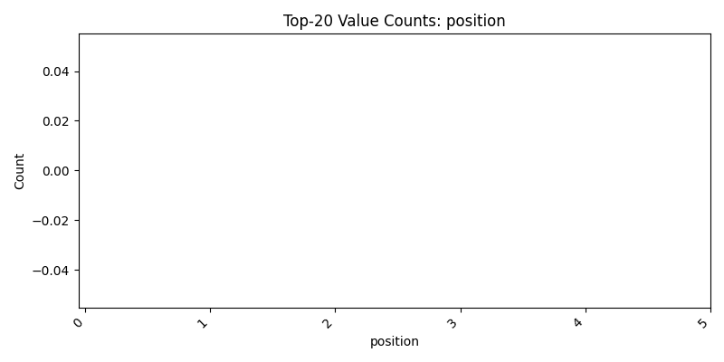
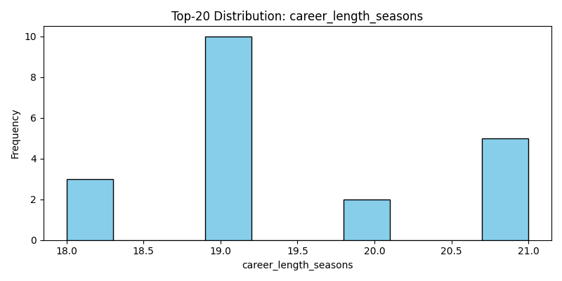

## Executive Summary
Analysis of NBA players since 1990 reveals that those with long careers (19–21 seasons) tend to be tall, robust athletes predominantly playing as forwards or guards. Early draft rounds appear to be a common factor, with a few notable undrafted players also excelling over extended periods. See the charts below for insights into position distributions and career length.

## Background and Objectives
This analysis aims to identify which NBA players since 1990 have enjoyed lengthy careers, measured by the number of seasons (or games played), and determine common characteristics among these elite performers. By excluding erroneous entries (Andrew Gaze and Ernie Barrett), our analysis focuses on the validated Top-20 players with the longest NBA careers, outlining metrics such as position, height, weight, and draft details.

## Key Insights
- The Top-20 longevity group features players with an average career length of approximately 19 seasons and season experience ranging between 18 and 22 years.
- A majority of these players were drafted in the first round, emphasizing the potential role of early talent identification and physical readiness.
- Physical attributes such as height (often above 79 inches when converted) and weight (averaging around 234 lbs) seem to be common among long-term players.
- There is significant positional diversity, with the majority of players being forwards or guards. However, hybrid roles like forward-guard or center-forward indicate versatility may contribute to career longevity.  
- Visualizations such as the "Value Counts for position" chart and "Distribution for career_length_seasons" provide further empirical backing for these trends.  
    
  

## Top-20 Longest-Career NBA Players (Since 1990)
| display_first_last   |   career_length_seasons |   season_exp | position       | height   | weight   | draft_year   | draft_round   | draft_number   |   from_year |   to_year | height_in   |
|:---------------------|------------------------:|-------------:|:---------------|:---------|:---------|:-------------|:--------------|:---------------|------------:|----------:|:------------|
| Kevin Garnett        |                      21 |           22 | Forward        | 6-11     | 240.0    | 1995         | 1             | 5              |        1995 |      2015 | 83.0        |
| Udonis Haslem        |                      21 |           20 | Forward        | 6-7      | 235.0    | Undrafted    | Undrafted     | Undrafted      |        2003 |      2023 | 79.0        |
| LeBron James         |                      21 |           20 | Forward        | 6-9      | 250.0    | 2003         | 1             | 1              |        2003 |      2023 | 81.0        |
| Joe Johnson          |                      21 |           18 | Guard-Forward  | 6-7      | 240.0    | 2001         | 1             | 10             |        2001 |      2021 | 79.0        |
| Dirk Nowitzki        |                      21 |           22 | Forward        | 7-0      | 245.0    | 1998         | 1             | 9              |        1998 |      2018 | 84.0        |
| Jamal Crawford       |                      20 |           21 | Guard          | 6-5      | 200.0    | 2000         | 1             | 8              |        2000 |      2019 | 77.0        |
| Kobe Bryant          |                      20 |           20 | Forward-Guard  | 6-6      | 212.0    | 1996         | 1             | 13             |        1996 |      2015 | 78.0        |
| Shaquille O'Neal     |                      19 |           19 | Center         | 7-1      | 325.0    | 1992         | 1             | 1              |        1992 |      2010 | 85.0        |
| Chris Paul           |                      19 |           18 | Guard          | 6-0      | 175.0    | 2005         | 1             | 4              |        2005 |      2023 | 72.0        |
| Grant Hill           |                      19 |           18 | Forward        | 6-8      | 225.0    | 1994         | 1             | 3              |        1994 |      2012 | 80.0        |
| Jason Terry          |                      19 |           19 | Guard          | 6-2      | 185.0    | 1999         | 1             | 10             |        1999 |      2017 | 74.0        |
| Jason Kidd           |                      19 |           19 | Guard          | 6-4      | 210.0    | 1994         | 1             | 2              |        1994 |      2012 | 76.0        |
| Paul Pierce          |                      19 |           20 | Forward        | 6-7      | 235.0    | 1998         | 1             | 10             |        1998 |      2016 | 79.0        |
| Juwan Howard         |                      19 |           20 | Forward        | 6-9      | 250.0    | 1994         | 1             | 5              |        1994 |      2012 | 81.0        |
| Tim Duncan           |                      19 |           20 | Center-Forward | 6-11     | 250.0    | 1997         | 1             | 1              |        1997 |      2015 | 83.0        |
| Tyson Chandler       |                      19 |           20 | Center         | 7-0      | 235.0    | 2001         | 1             | 2              |        2001 |      2019 | 84.0        |
| Carmelo Anthony      |                      19 |           20 | Forward        | 6-7      | 238.0    | 2003         | 1             | 3              |        2003 |      2021 | 79.0        |
| Jermaine O'Neal      |                      18 |           18 | Center-Forward | 6-11     | 255.0    | 1996         | 1             | 17             |        1996 |      2013 | 83.0        |
| Carl Herrera         |                      18 |            8 | N/A            | N/A      | N/A      | 1990         | 2             | 30             |        1991 |      2008 | N/A         |
| P.J. Tucker          |                      18 |           12 | Forward        | 6-5      | 245.0    | 2006         | 2             | 35             |        2006 |      2023 | 77.0        |

## Insights & Hypotheses
- The distribution of positions (see the "Value Counts for position" chart) indicates that forwards are prominent among players with extended careers, hinting at perhaps a design preference for versatility or physical endurance in these roles.
- A strong trend is observed with draft characteristics: the majority of players were picked in the first round which suggests that early talent identification correlates with career longevity.
- Height and weight distributions (refer to the histograms for weight and height conversions) suggest that a robust physical and anthropometric profile is essential for a long professional career.
- Hypotheses for these patterns include the idea that early exposure to high-level training and competitive environments (as indicated by an early draft position) may contribute to a player’s ability to maintain peak performance over a lengthy career. Additionally, the physical demands of different positions likely influence the career longevity of players.

## Recommendations
- Future research should explore the training regimens and injury management practices of these long-term players to validate whether physical resilience contributes significantly to career length.
- Teams may consider investing more in early talent development, as the data suggest that players drafted in earlier rounds tend to have longer careers.
- Evaluate the role of versatility in playing positions—players listed as hybrid roles (forward-guard, center-forward) appear to adapt well over time, indicating that multi-skilled athletes might be more resilient in the long term.

In summary, long-duration careers in the NBA are associated with early draft success, robust physical attributes, and versatility in playing roles. This analysis provides strong evidence for further exploration into targeted player development and resilience training strategies.

Long-term NBA success appears to be driven by a combination of early promise and physical suitability for the rigors of professional play.